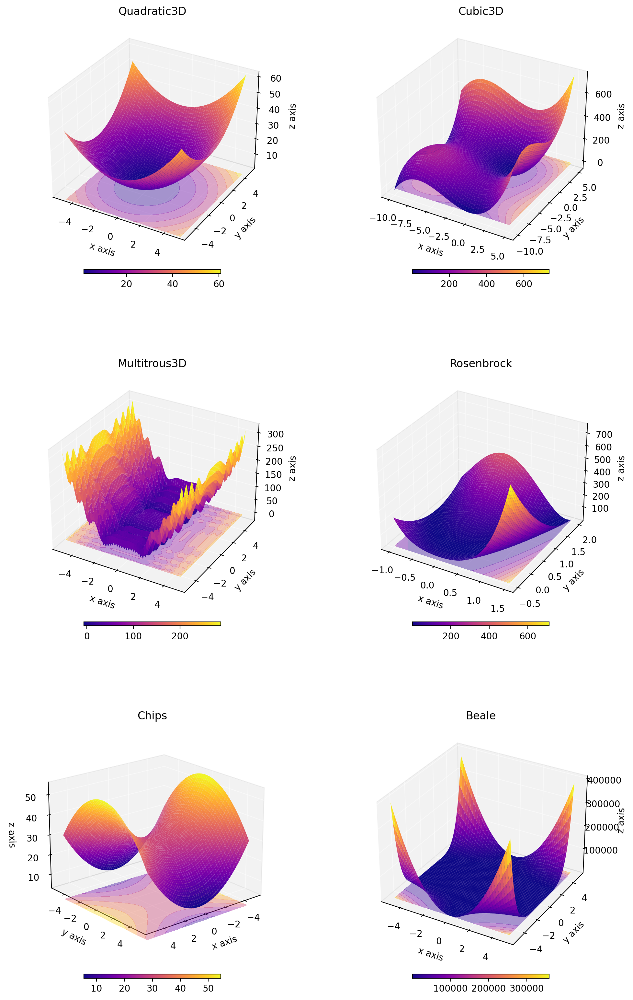
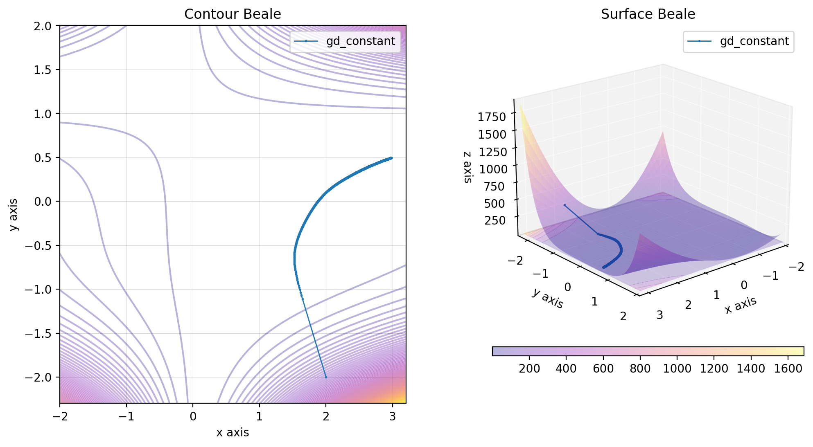

# Descent Project

## Description

This project aims to display any function $R \rightarrow R$ or $R^2 \rightarrow R$ and to compare different gradient descent methods to find the minimum of this function in a visual way.

## Figures

Some functions have already been implemented and can be use as followed.

```python
from descent.figure3d import Cubic3D

cubic_3d = Cubic3D(np.array([10, 10]))
x = np.linspace(-10, 5, 100)
X = np.stack((x, x), axis=-1)
cubic_3d.figure(X, plot_contour=True)
```


### Some $R \rightarrow R$ functions have been implemented:

This function can be used as followed:
```python
from descent.figure2d import Quadratic2D, Cubic2D, Multitrous2D

quadratic_2d = Quadratic2D()
cubic_2d = Cubic2D()
multitrous_2d = Multitrous2D()
```


### Some $R^2 \rightarrow R$ functions have been implemented:

This function can be used as followed:
```python
from descent.figure3d import Quadratic3D, Cubic3D, Multitrous3D, Rosenbrock, QuadraticN

quadratic_3d = Quadratic3D()
cubic_3d = Cubic3D()
multitrous_3d = Multitrous3D()
rosenbrock = Rosenbrock()
quadratic_n = QuadraticN() # Quadratic function but with a different conditionning
```




## Gradient descent

Different gradient descent methods have been implemented and can be used.

### Gradient descent with fixed step

```python
from descent.gradient import GradientDescentConstant

x, y = np.linspace(-1, 1.5, 200), np.linspace(-0.5, 2, 200)
x = np.stack((x, y), axis=-1)
rosenbrock = Rosenbrock(100)

x0 = np.array([0, 2])
mu = 0.00001

gd_constant = GradientDescentConstant()
res_gd_constant = gd_constant(rosenbrock, x0, mu)

descents = {
    "gd_constant": res_gd_constant,
}

rosenbrock.figure(x, descent=descents, plot_contour=True)
```



### Gradient descent with backtracking, Armijo rule

```python
from descent.gradient import GradientDescentOptimalStep

x, y = np.linspace(-1, 1.5, 200), np.linspace(-0.5, 2, 200)
x = np.stack((x, y), axis=-1)
rosenbrock = Rosenbrock(100)

x0 = np.array([0, 2])

gd_optimal = GradientDescentOptimalStep()
res_gd_optimal = gd_optimal(rosenbrock, x0)

descents = {
    "gd_optimal": res_gd_optimal,
}

rosenbrock.figure(x, descent=descents, plot_contour=True)
```


### Gradient descent with L1 optimization


```python
from descent.gradient import GradientDescentL1Optimisation

x, y = np.linspace(-1, 1.5, 200), np.linspace(-0.5, 2, 200)
x = np.stack((x, y), axis=-1)
rosenbrock = Rosenbrock(100)

x0 = np.array([0, 2])

gd_l1 = GradientDescentL1Optimisation()
res_gd_l1 = gd_l1(rosenbrock, x0)

descents = {
    "gd_l1": res_gd_l1,
}

rosenbrock.figure(x, descent=descents, plot_contour=True)
```


### Gradient descent comparison

You can plot the different gradient descent methods on the same figure as followed:

```python
from descent.gradient import GradientDescentConstant
from descent.gradient import GradientDescentOptimalStep
from descent.gradient import GradientDescentL1Optimisation

x, y = np.linspace(-1, 1.5, 200), np.linspace(-0.5, 2, 200)
x = np.stack((x, y), axis=-1)
rosenbrock = Rosenbrock(100)

x0 = np.array([0, 2])
mu = 0.00001

gd_constant = GradientDescentConstant()
res_gd_constant = gd_constant(rosenbrock, x0, mu)

gd_optimal = GradientDescentOptimalStep()
res_gd_optimal = gd_optimal(rosenbrock, x0)

gd_l1 = GradientDescentL1Optimisation()
res_gd_l1 = gd_l1(rosenbrock, x0)

descents = {
    "gd_constant": res_gd_constant,
    "gd_optimal": res_gd_optimal,
    "gd_l1": res_gd_l1,
}

rosenbrock.figure(x, descent=descents, plot_contour=True)
```


## Add your own function

### Add your own figures

You can add your own figures and try different gradient descent methods on it simply by creating a new class that inherits from the Figure class.


#### $R \rightarrow R$ function

```python
import numpy as np
from descent.figure2d import Figure2D
from descent.gradient import GradientDescentL1Optimisation


class MyFigure2D(Figure2D):
    def __name__(self) -> str:
        return "MyFigure2D"

    def __init__(self, alpha: float = 0.0):
        self.alpha = alpha

    def function(self, x: np.array) -> np.array:
        return np.sin(x) + np.cos(x) + self.alpha

my_figure = MyFigure2D(1)

x0 = np.array([0])
opti = GradientDescentL1Optimisation()

res_opti = opti(my_figure, x0)

descents = {
    "gd_l1": res_opti,
}

my_figure.figure(descent=descents)
```


#### $R^2 \rightarrow R$ function

```python
import numpy as np
from descent.figure3d import Figure3D
from descent.gradient import GradientDescentL1Optimisation


class MyFigure3D(Figure3D):
    def __name__(self) -> str:
        return "MyFigure"

    def function(self, x: np.array) -> np.array:
        return np.sin(x[0]) + np.cos(x[1])

my_figure = MyFigure3D()

x0 = np.array([1.5, 0])
opti = GradientDescentL1Optimisation()

res_opti = opti(my_figure, x0)

descents = {
    "gd_l1": res_opti,
}

my_figure.figure(plot_contour=True, descent=descents)
```


