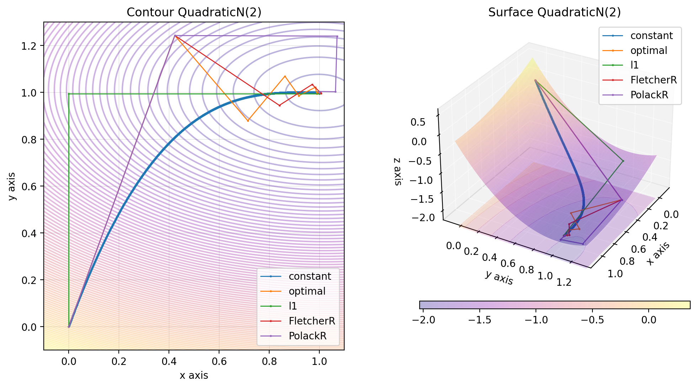

# Descent Project

## Description

This project aims to display any function $R \rightarrow R$ or $R^2 \rightarrow R$ and to compare different gradient descent methods to find the minimum of this function in a visual way.

## Figures

Some functions have already been implemented and can be use as followed.

```python
import numpy as np
from descent.figure3d import Cubic3D

cubic_3d = Cubic3D(np.array([10, 10]))
x = np.linspace(-10, 5, 100)
X = np.stack((x, x), axis=-1)
cubic_3d.figure(X, plot_contour=True)
```


**Some $R \rightarrow R$ functions have been implemented:**

This function can be used as followed:
```python
from descent.figure2d import Quadratic2D, Cubic2D, Multitrous2D

quadratic_2d = Quadratic2D()
cubic_2d = Cubic2D()
multitrous_2d = Multitrous2D()
```


**Some $R^2 \rightarrow R$ functions have been implemented:**

This function can be used as followed:
```python
from descent.figure3d import Quadratic3D, Cubic3D, Multitrous3D, Rosenbrock, QuadraticN, Chips, Beale

quadratic_3d = Quadratic3D()
cubic_3d = Cubic3D()
multitrous_3d = Multitrous3D()
rosenbrock = Rosenbrock()
quadratic_n = QuadraticN() # Quadratic function but with a different conditionning
chips = Chips()
beale = Beale()
```


## Gradient descent

Different gradient descent methods have been implemented and can be used.

### Gradient descent with fixed step

#### Algorithm

To implement Gradient Descent with a fixed step, we begin by selecting a constant step size (learning rate), denoted as $\eta$, and choose an initial point ${\bf p}_0$.

As long as the norm $|| {\bf p}_{k+1} - {\bf p}_k|| > \varepsilon$ with $\varepsilon$ a small value:

1. Compute the gradient of the objective function $J$ at the current point: $\nabla J({\bf p}_k)$.
2. Choose a descent direction ${\bf d}_k = - \nabla J({\bf p}_k)$.
3. Move in this direction: ${\bf p}_{k+1} = {\bf p}_k + \eta {\bf d}_k$.


#### Usage


```python
import numpy as np
from descent.figure3d import Beale
from descent.gradient import GradientDescentConstant

beale = Beale()
x0 = np.array([2, -2])
lr = 0.001

x = np.linspace(-2, 3.2, 100)
y = np.linspace(-2.3, 2, 100)
X = np.stack((x, y), axis=-1)

gd_constant = GradientDescentConstant()
res_gd_constant = gd_constant(beale, x0, lr)

descent = {
    "gd_constant": res_gd_constant
}

beale.figure(X, descent=descent, plot_contour=True, view=(20, 50))
```


### Gradient descent with backtracking, Armijo rule

To enhance the convergence of the algorithm, we introduce a variable learning rate $\eta$ using the Armijo rule.

#### Mathematical Background

To ensure the convergence of the sequence $J({\bf p}_k)$, we impose a decrease in its value. The Armijo rule introduces two parameters, $0 < \alpha < 0.5$ and $0 < \beta < 1$.

We seek a $\eta$ that satisfies the Armijo condition:

$$ J({\bf p}_k + \eta {\bf d}_k) < J({\bf p}_k) + \alpha \eta {\bf d}_k ^T \nabla J({\bf p}_k) \quad (1). $$

A suitable $\eta$ exists whenever ${\bf d}_k$ is a descent direction, meaning ${\bf d}_k ^T \nabla J({\bf p}_k) < 0$.

The Armijo Rule is implemented as follows:

1. Start with an initial value $\eta = 1$.
2. While condition $(1)$ is not satisfied:
   - Adjust $\eta$ to $\beta \eta$.

#### Algorithm

The algorithm is the same as the one with a fixed step, except for the learning rate $\eta$.

As long as the norm $|| {\bf p}_{k+1} - {\bf p}_k|| > \varepsilon$ with $\varepsilon$ a small value:

1. Compute the gradient of the objective function $J$ at the current point: $\nabla J({\bf p}_k)$.
2. Choose a descent direction ${\bf d}_k = - \nabla J({\bf p}_k)$.
3. Compute the learning rate $\eta$ using the Armijo rule.
4. Move in this direction: ${\bf p}_{k+1} = {\bf p}_k + \eta {\bf d}_k$.

#### Usage

```python
import numpy as np
from descent.figure3d import Beale
from descent.gradient import GradientDescentOptimalStep

beale = Beale()
x0 = np.array([2, -2])

x = np.linspace(-2, 3.2, 100)
y = np.linspace(-2.3, 2, 100)
X = np.stack((x, y), axis=-1)

gd_optimal = GradientDescentOptimalStep()
res_gd_optimal = gd_optimal(beale, x0)

descent = {
    "gd_optimal": res_gd_optimal,
}

beale.figure(X, descent=descent, plot_contour=True, view=(20, 50))
```


### Gradient descent with L1 optimization

#### Mathematical Background

In L1 optimization, the descent direction is not necessarily $-\nabla J({\bf p_k})$; instead, it is another direction $d_k$ that satisfies $\langle \nabla J({\bf p_k}) , d_k \rangle < 0$ for descent (not ascent).

Here, we choose the steepest descent in the case of the $\ell_1$ norm: the descent direction $d_k$ follows the vector of the canonical basis with the highest partial derivative in absolute value.

${\bf d}_k = -\langle \nabla J({\bf p}_k),e_i \rangle e_i$

where $i$ is the smallest index such that:

 ```math
 \left| \dfrac{\partial J}{\partial x_i}({\bf p}_k) \right| = \|\nabla J({\bf p}_k)\|_{\infty} $$
 ```

#### Algorithm

The algorithm is the same as the one with an optimal step, except for the descent direction ${\bf d}_k$.

As long as the norm $|| {\bf p}_{k+1} - {\bf p}_k|| > \varepsilon$ with $\varepsilon$ a small value:

1. Compute the gradient of the objective function $J$ at the current point: $\nabla J({\bf p}_k)$.
2. Choose a descent direction ${\bf d}_k$ = $-\langle \nabla J({\bf p}_k),e_i \rangle \, e_i$.
3. Compute the learning rate $\eta$ using the Armijo rule.
4. Move in this direction: ${\bf p}_{k+1} = {\bf p}_k + \eta {\bf d}_k$.


#### Usage


```python
import numpy as np
from descent.figure3d import Beale
from descent.gradient import GradientDescentL1Optimisation

beale = Beale()
x0 = np.array([2, -2])

x = np.linspace(-2, 3.2, 100)
y = np.linspace(-2.3, 2, 100)
X = np.stack((x, y), axis=-1)

gd_l1 = GradientDescentL1Optimisation()
res_gd_l1 = gd_l1(beale, x0)

descent = {
    "gd_l1": res_gd_l1,
}

beale.figure(X, descent=descent, plot_contour=True, view=(20, 50))
```


### Gradient Descent with compose gradient, Fletcher-Reeves

#### Mathematical Background

In the Fletcher-Reeves method, the descent direction is modified by adding to the opposite of the gradient a term that depends on the previous descent directions. This choice of descent is made to make two descent directions orthogonal for the scalar product that comes from the Hessian.

$d_k$ is defined by the following relation:

$d_k = -\nabla J(x_k) + \beta_k d_{k-1}$ avec $\beta_k = \dfrac{\|\nabla J(x_k)\|^2}{\|\nabla J(x_{k-1})\|^2}$

#### Algorithm

The algorithm is the same as the one with an optimal step, except for the descent direction ${\bf d}_k$.

As long as the norm $|| {\bf p}_{k+1} - {\bf p}_k|| > \varepsilon$ with $\varepsilon$ a small value:

1. Choose a descent direction ${\bf d}_k$ using the Fletcher-Reeves method.
2. Compute the learning rate $\eta$ using the Armijo rule.
3. Move in this direction: ${\bf p}_{k+1} = {\bf p}_k + \eta {\bf d}_k$.


#### Usage

```python
import numpy as np
from descent.figure3d import Beale
from descent.gradient import GradientDescentFletcherReeves

beale = Beale()
x0 = np.array([2, -2])

x = np.linspace(-2, 3.2, 100)
y = np.linspace(-2.3, 2, 100)
X = np.stack((x, y), axis=-1)

gd_fletcherR = GradientDescentFletcherReeves()
res_gd_fr = gd_fletcherR(beale, x0)

descent = {
    "gd_fletcherR": res_gd_fr,
}

beale.figure(X, descent=descent, plot_contour=True, view=(20, 50))
```


### Gradient Descent with compose gradient, Polack-Ribière

#### Mathematical Background

An alternative method is that proposed by Polack-Ribière.

$d_k$ is then defined by the following relation:

$d_k = -\nabla J(x_k) + \beta_k d_{k-1}$ avec $\beta_k = \dfrac{\nabla J(x_k)^T (\nabla J(x_k) - \nabla J(x_{k-1}))}{\|\nabla J(x_{k-1})\|^2}$

#### Algorithm

The algorithm is the same as the one with an optimal step, except for the descent direction ${\bf d}_k$.

As long as the norm $|| {\bf p}_{k+1} - {\bf p}_k|| > \varepsilon$ with $\varepsilon$ a small value:

1. Choose a descent direction ${\bf d}_k$ using the Polack-Ribière method.
2. Compute the learning $\eta$ using the Armijo rule.
3. Move in this direction: ${\bf p}_{k+1} = {\bf p}_k + \eta {\bf d}_k$.

#### Usage

```python
import numpy as np
from descent.figure3d import Beale
from descent.gradient import GradientDescentPolackRibiere

beale = Beale()
x0 = np.array([2, -2])

x = np.linspace(-2, 3.2, 100)
y = np.linspace(-2.3, 2, 100)
X = np.stack((x, y), axis=-1)

gd_polackR = GradientDescentPolackRibiere()
res_gd_pr = gd_polackR(beale, x0)

descent = {
    "gd_polackR": res_gd_pr,
}

beale.figure(X, descent=descent, plot_contour=True, view=(20, 50))
```


### Gradient descent comparison

You can plot the different gradient descent methods on the same figure as followed:

```python
import numpy as np
from descent.figure3d import QuadraticN
from descent.gradient import GradientDescentConstant
from descent.gradient import GradientDescentOptimalStep
from descent.gradient import GradientDescentL1Optimisation
from descent.gradient import GradientDescentFletcherReeves
from descent.gradient import GradientDescentPolackRibiere 
from descent.functions import create_system

A, b = create_system(2, 3)
x_exact = np.ones(2, dtype=np.float64)
b = A @ x_exact
x0 = np.zeros(2, dtype=np.float64)

quadratic_n = QuadraticN(A, b)

gd_constant = GradientDescentConstant()
res_constant = gd_constant(quadratic_n, x0, mu = 0.9 / 1000)

gd_optimal = GradientDescentOptimalStep()
res_optimal = gd_optimal(quadratic_n, x0)

gd_l1 = GradientDescentL1Optimisation()
res_l1 = gd_l1(quadratic_n, x0)

gd_fr = GradientDescentFletcherReeves()
res_fr = gd_fr(quadratic_n, x0)

gd_pr = GradientDescentPolackRibiere()
res_pr = gd_pr(quadratic_n, x0)

x, y = np.linspace(-0.1, 1.1, 150), np.linspace(-0.1, 1.3, 150)
X = np.stack((x, y), axis=-1)

descent = {
    'constant': res_constant,
    'optimal': res_optimal,
    'l1': res_l1,
    'FletcherR': res_fr,
    'PolackR': res_pr
}

quadratic_n.figure(X, descent=descent, plot_contour=True, view=(30, 30))
```




## Gradient descent and Momentum method

Momentums are used to accelerate the convergence of the gradient descent. The idea is to add a term to the descent direction that depends on the previous descent directions. It helps to optimise non convex functions.

### Gradient descent with momentum

#### Mathematical Background

The gradient descent with momentum is defined by the following relation:

$${\bf d}_k = \gamma {\bf d}_{k-1} + (1 - \gamma) \nabla J({\bf p}_k)$$

Where $\gamma$ is the momentum parameter, between 0 and 1.

#### Algorithm

As long as the norm $|| {\bf p}_{k+1} - {\bf p}_k|| > \varepsilon$ with $\varepsilon$ a small value:

1. Choose a descent direction ${\bf d}_k$ using the previous method.
2. Move in this direction: ${\bf p}_{k+1} = {\bf p}_k - \eta {\bf d}_k$.

#### Usage

```python
import numpy as np
from descent.figure3d import Beale
from descent.gradient import GradientDescentMomentumAcceleration

beale = Beale()
x0 = np.array([2, -2])

x = np.linspace(-2, 3.2, 100)
y = np.linspace(-2.3, 2, 100)
X = np.stack((x, y), axis=-1)

gd_momentum = GradientDescentMomentumAcceleration()
res_gd_momentum = gd_momentum(beale, x0, lr=0.0001)

descent = {
    "gd_momentum": res_gd_momentum,
}

beale.figure(X, descent=descent, plot_contour=True, view=(20, 50))
```


### Gradient descent with Nesterov momentum

#### Mathematical Background

The gradient descent with Nesterov momentum is defined by the following relation:

$${\bf d}_k = \gamma {\bf d}_{k-1} + (1 - \eta) \nabla J({\bf p}_k - \gamma {\bf d}_{k-1})$$

#### Algorithm

As long as the norm $|| {\bf p}_{k+1} - {\bf p}_k|| > \varepsilon$ with $\varepsilon$ a small value:

1. Choose a descent direction ${\bf d}_k$ using the previous method.
2. Move in this direction: ${\bf p}_{k+1} = {\bf p}_k - {\bf d}_k$.

#### Usage

```python
import numpy as np
from descent.figure3d import Beale
from descent.gradient import GradientDescentNesterovAcceleration

beale = Beale()
x0 = np.array([2, -2])

x = np.linspace(-2, 3.2, 100)
y = np.linspace(-2.3, 2, 100)
X = np.stack((x, y), axis=-1)

gd_nesterov = GradientDescentNesterovAcceleration()
res_gd_nesterov = gd_nesterov(beale, x0, lr=0.0001)

descent = {
    "gd_nesterov": res_gd_nesterov,
}

beale.figure(X, descent=descent, plot_contour=True, view=(20, 50))
```


## Add your own function

### Add your own figures

You can add your own figures and try different gradient descent methods on it simply by creating a new class that inherits from the Figure class.


**$R \rightarrow R$ function**

```python
import numpy as np
from descent.figure2d import Figure2D
from descent.gradient import GradientDescentL1Optimisation


class MyFigure2D(Figure2D):
    def __name__(self) -> str:
        return "MyFigure2D"

    def __init__(self, alpha: float = 0.0):
        self.alpha = alpha

    def function(self, x: np.array) -> np.array:
        return np.sin(x) + np.cos(x) + self.alpha

my_figure = MyFigure2D(1)

x0 = np.array([0])
opti = GradientDescentL1Optimisation()

res_opti = opti(my_figure, x0)

descents = {
    "gd_l1": res_opti,
}

my_figure.figure(descent=descents)
```


**$R^2 \rightarrow R$ function**

```python
import numpy as np
from descent.figure3d import Figure3D
from descent.gradient import GradientDescentL1Optimisation


class MyFigure3D(Figure3D):
    def __name__(self) -> str:
        return "MyFigure"

    def function(self, x: np.array) -> np.array:
        return np.sin(x[0]) + np.cos(x[1])

my_figure = MyFigure3D()

x0 = np.array([1.5, 0])
opti = GradientDescentL1Optimisation()

res_opti = opti(my_figure, x0)

descents = {
    "gd_l1": res_opti,
}

my_figure.figure(plot_contour=True, descent=descents)
```


